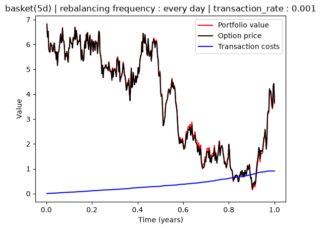
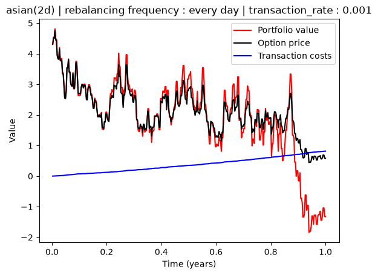
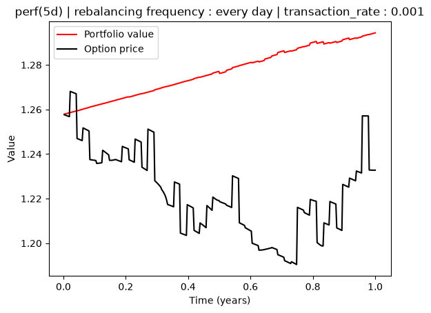

# Delta Hedging

## Overview

This is an academic delta-hedging project, adapted from the original course project with two main changes:

- **Rebalancing schedule.** The original project supported two rebalancing oracles: on spot variation, or on a fixed period. This version only implements **fixed-period rebalancing**.
- **Pricing engine.** The original relied on a separate pricer library provided for the course. This version uses my own option pricer, [pricer](https://github.com/leandrej64/pricer), instead: the C++ pricer is compiled as a shared library (`.so`) and called from this C# project through a thin C bridge (`extern "C"` API), via P/Invoke.

The primary goal of this project is to **visually observe how well a discretely-rebalanced replicating portfolio tracks an option's theoretical price**, and to highlight the discrepancies with theory introduced by discretization (finite rebalancing frequency instead of continuous hedging). For the precise definition of each option type and its payoff, refer to the [pricer](https://github.com/leandrej64/pricer) project.

## Repository structure

```
hedging/
├── BackTester/        # C# console project (the backtest itself)
├── data/               # option definitions (.json) and simulated market paths (.txt)
├── hedging_data/       # JSON exports of each backtest run
├── figures/            # exported plots
└── hedging_review.ipynb  # notebook used to plot the results
```

### Classes (`BackTester/`)

| Class | File | Role |
|---|---|---|
| `Tester` | `BackTester.cs` | Orchestrates the backtest: steps through time on a fixed grid, calls the pricer at each rebalancing date, and drives the portfolio updates. |
| `Portfolio` | `Portfolio.cs` | Self-financing portfolio bookkeeping: cash (accruing at the risk-free rate between rebalancing dates), asset composition, mark-to-market value, and transaction costs. |
| `NativePricer` | `NativePricer.cs` | P/Invoke bridge to the native `pricer_capi` shared library (pricing and market spot queries). |
| `PricingResult` | `PricingResult.cs` | Managed object exposing a pricing call's result (price, deltas and their standard deviations). |
| `HedgingData` | `HedgingData.cs` | A single time-step's recorded state (time, portfolio value, option price, cumulated transaction costs). |
| `Program.cs` | — | Entry point: wires everything together and exports the run's results to JSON. |

## Results

Three option types were backtested with daily rebalancing: a 5-asset basket option, an Asian option, and a performance ("cliquet") option. Portfolio value is plotted in red, option price in black.

**Basket (5 assets)**



**Asian**



**Performance**



For the basket and Asian options, the replicating portfolio tracks the option's price closely — the residual gap is consistent with the expected discretization error of a finitely-rebalanced hedge.

For the performance option, the two curves diverge markedly. This is expected, not a bug: a performance/cliquet payoff (a sum of positive period-over-period returns of a diversified basket) is, by construction, almost insensitive to the current spot level — its deltas, as computed by the pricer, are of the order of `1e-6`, essentially zero. A delta hedge is therefore structurally the wrong instrument for this payoff: the replicating portfolio ends up holding close to no shares (nearly pure cash), while the option's fair value keeps evolving as each period's return is realized. The two curves are not expected to match.
